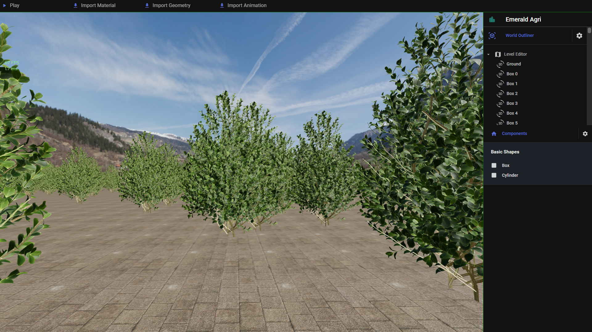

# emerald-city

## Overview

- TODO

<picture>
  <source media="(prefers-color-scheme: dark)" srcset="./assets/landing-image.png">
  <source media="(prefers-color-scheme: light)" srcset="./assets/landing-image.png">
  
</picture>

## Ref:

- AOMap --> Red Channel
- RoughnessMap --> Green Channel
- MetalnessMap --> Blue Channel

## LICENCE

GNU Affero General Public License 3.0 (AGPL-3.0-only)

**For licensing contact the code owners.**

## Code Owners

- Saikat Dey [Team Lead] (notfathomless) digonto.pvt.2021@gmail.com https://github.com/notfathomless
- Sayantan Pal (sayantan135) palsayantan2002@gmail.com https://github.com/sayantan135
- Sudip Ghosh sudip.leo07@gmail.com https://github.com/SUDIP1969

## Team Name

- **IceBox**
